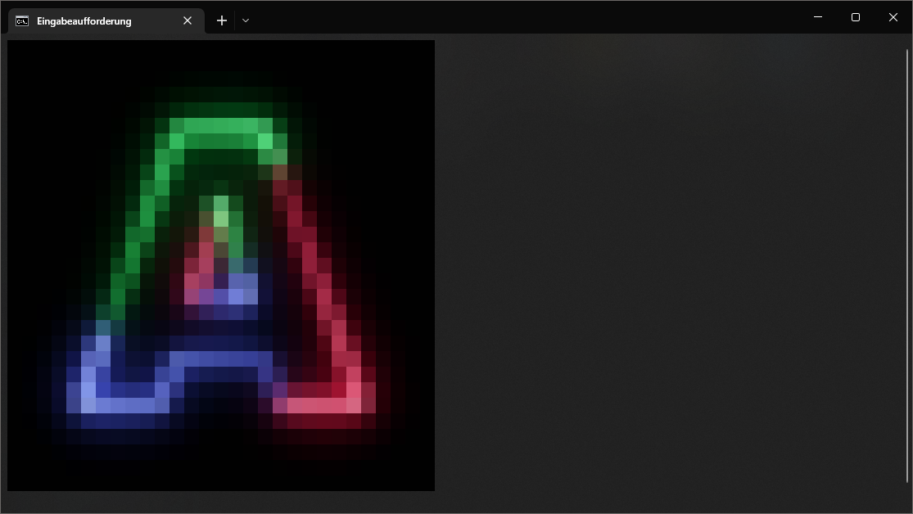
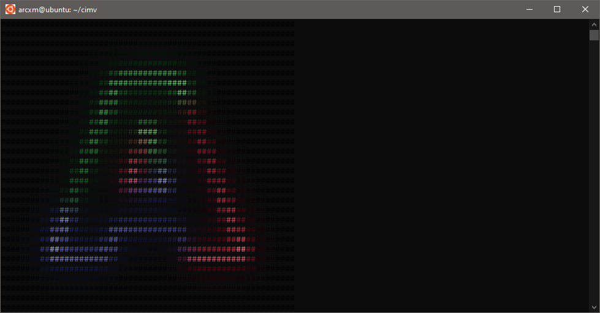

# cimv

An image viewer for the terminal written in C.

In the current version, cimv scales the images to fit the terminal size.

cimv uses [ANSI Color Escape Codes](https://en.wikipedia.org/wiki/ANSI_escape_code#Colors) to draw images in the terminal.

## **Thanks**

**Huge thanks** to [stb](https://github.com/nothings/stb) and their single-header C libraries without which this would not have been possible.

## Table of Contents

- [Build](#build)
- [Usage](#usage)
- [Changelog](#changelog)
- [Plans](#plans)
- [Examples (Screenshots)](#examples)
- [Known Issues](#known-issues)

## Build

`main`: latest stable version.

`develop`: most recent in-develop version.

See [Tags](https://github.com/Arcxm/cimv/tags) for specific versions.

To build cimv, simply run make.

## Usage

```console
$ ./cimv -h
$ ./cimv my_image.png
```

## Changelog

### 0.2

- Added support for linux

### 0.1

- First release

## Plans

- Fix [Known Issues](#known-issues)
- Allow moving the image
- Support image scaling
- Support mirroring, flipping upside down
- Customization of drawing character
- Add filters
    - Grayscale
    - Invert colors
    - ...
- ...

## Examples

Using my GitHub Avatar.

### Windows



### Linux



## Known Issues

- Images with an alpha channel might fail resizing and nothing is drawn
- Some big images are not drawn properly