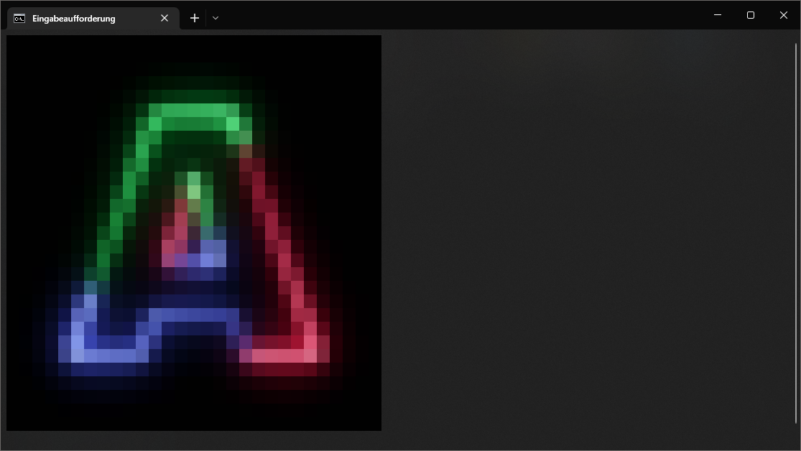

# cimv

An image viewer for the terminal written in C.

In the current version, cimv scales the images to fit the terminal size.

cimv uses [ANSI Color Escape Codes](https://en.wikipedia.org/wiki/ANSI_escape_code#Colors) to draw images in the terminal.

Also, cimv currently only supports Windows as it uses the windows headers to determine the terminal size, but support for other operating systems is planned (see [Plans](#plans))!

## **Thanks**

**Huge thanks** to [stb](https://github.com/nothings/stb) and their single-header C libraries without which this would not have been possible.

## Table of Contents

- [Build](#build)
- [Usage](#usage)
- [Plans](#plans)
- [Examples (Screenshot)](#examples)
- [Known Issues](#known-issues)

## Build

`main`: latest stable version.

`develop`: most recent in-develop version.

See [Tags](https://github.com/Arcxm/cimv/tags) for specific versions.

To build cimv, simply run make.

## Usage

```console
$ ./cimv -h
$ ./cimv my_image.png
```

## Plans

- Fix [Known Issues](#known-issues)
- Support other operating systems
- Allow moving the image
- Support image scaling
- Support mirroring, flipping upside down
- Add filters
    - Grayscale
    - Invert colors
    - ...
- ...

## Examples

### My GitHub Avatar



## Known Issues

- Images with an alpha channel might fail resizing and nothing is drawn
- Some big images are not drawn properly